[](https://dev.azure.com/dibakarroy24/ensure-quality-release/_build/latest?definitionId=34&branchName=master)

# Ensuring Quality Releases: Building a Quality Assurance Pipeline using Azure DevOps

## Project Overview
In this project, you'll develop and demonstrate your skills in using a variety of industry leading tools, especially Microsoft Azure, to create disposable test environments and run a variety of automated tests with the click of a button. Additionally, you'll monitor and provide insight into your application's behavior, and determine root causes by querying the application’s custom log files.

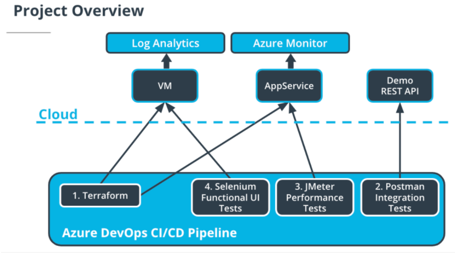

## Project Tools and Environment
Install, set up and configure the following dependencies and apply them all together.

## Dependencies:
* Azure DevOps
* Terraform
* Postman
* Python
* Selenium
* JMeter
* Azure Portal
* Azure CLI

## Installation & Configuration:

### Terraform in Azure

[Configure the storage account and state backend](https://docs.microsoft.com/en-us/azure/developer/terraform/store-state-in-azure-storage). Replace the values below in terraform/environments/test/main.tf with the output from the Azure CLI:
* storage_account_name
* container_name
* access_key

[Create a Service Principal for Terraform](https://registry.terraform.io/providers/hashicorp/azurerm/latest/docs/guides/service_principal_client_secret). Replace the below values in terraform/environments/test/terraform.tfvars with the output from the Azure CLI:
* subscription_id
* client_id
* client_secret
* tenant_id

However, I have used the [Pipeline Variables](https://docs.microsoft.com/en-us/azure/devops/pipelines/process/variables?view=azure-devops&tabs=yaml%2Cbatch) here for the same.

### Azure DevOps

[Follow the instructions](https://docs.microsoft.com/en-us/azure/devops/pipelines/create-first-pipeline?view=azure-devops&tabs=java%2Ctfs-2018-2%2Cbrowser) to create a new Azure Pipeline from the azure-pipelines.yaml file.

### Selenium

[Download the latest Chrome driver](https://sites.google.com/a/chromium.org/chromedriver/).

```
pip install -U selenium
sudo apt-get install -y chromium-browser
```
Important -> You will need to [add the chromedriver to PATH](https://sites.google.com/a/chromium.org/chromedriver/getting-started).

### JMeter

1. [Install JMeter](https://jmeter.apache.org/download_jmeter.cgi). However, I have used the "JMeter Tool Installer" [plugin](https://marketplace.visualstudio.com/items?itemName=AlexandreGattiker.jmeter-tasks) from the Marketplace.

2. Replace the APPSERVICEURL with the URL of your AppService once it's deployed.

### Postman

[Install Postman](https://www.postman.com/downloads/).

### Dev Environment

1. Open the files in the Project Starter Resources folder using the IDE of your choice.

2. Complete the "Getting Started," and each of the "Installation" sections.

3. [Create an SSH key pair](https://docs.microsoft.com/en-us/azure/virtual-machines/linux/mac-create-ssh-keys) for the linux machine. Use the reference to the file for the Dev Environment. Use the actual public key itself when using Terraform in the CI/CD pipeline.

4. Run the terraform commands to create the resources in Azure.
```
.\path\to\terraform\terraform.exe init
.\path\to\terraform\terraform.exe apply
```

5. At this point, you are able to:
    * Write automated tests in Postman, JMeter and Selenium.
    * Check-in changes to the Git repo in Azure DevOps.
    * Run the CI/CD pipeline to deploy changes to an AppService. If this does not load, you may need to check the AppService Configuration in Azure and ensure WEBSITE_RUN_FROM_PACKAGE is set to 0.
    * Note that the deployment to the VM will fail since it is not configured as a deployment target yet.

6. Configure the Linux VM for deployment:
    * SSH into the VM using the Public IP.
    * Alternatively, you can use the 'Reset Password' function in Azure for the VM resource and then try SSH using those credentials.
    * [Follow the instructions to create an environment in Azure DevOps](https://docs.microsoft.com/en-us/azure/devops/pipelines/ecosystems/deploy-linux-vm?view=azure-devops&tabs=java).
    * If the registration script shows "sudo: ./svc.sh: command not found":
        ```
        sudo bin/installdependencies.sh
        cd ..
        sudo rm -rf azagent
        ```
    * Run the registration script again.
    * [Add your user to the sudoers file](https://askubuntu.com/questions/7477/how-can-i-add-a-new-user-as-sudoer-using-the-command-line).

7. Update azure-pipelines.yaml with the Environment, and run the pipeline. You can now deploy to the Linux VM.

8. Configure Logging for the VM in the Azure Portal.

## Project Steps:

1. Use Terraform to create the following resources for a specific environment tier:

    * AppService
    * Network
    * Network Security Group
    * Public IP
    * Resource Group
    * Linux VM (created by you -- use a Standard_B1s size for lowest cost)

    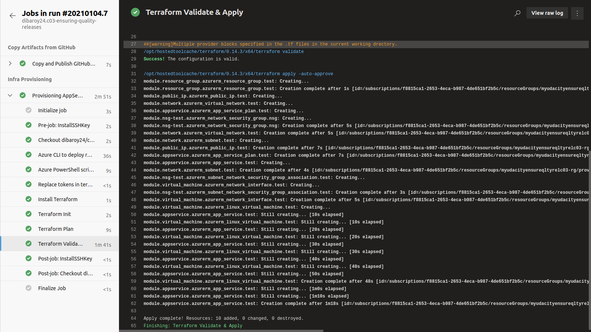

2. For the Azure DevOps CI/CD pipeline:

    * Create the tasks that allow for Terraform to run and create the above resources.

    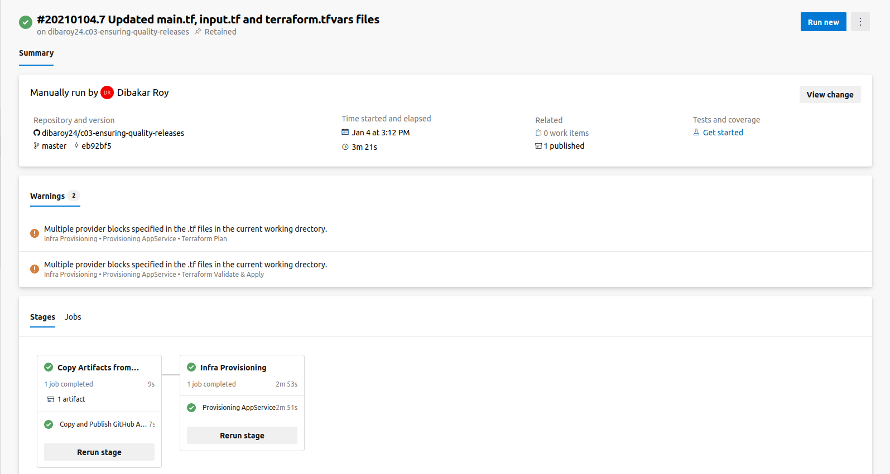

    * Execute Test Suites for:
        * Postman - runs during build stage
        * Selenium - runs on the linux VM in the deployment stage
        * JMeter - runs against the AppService in the deployment stage

    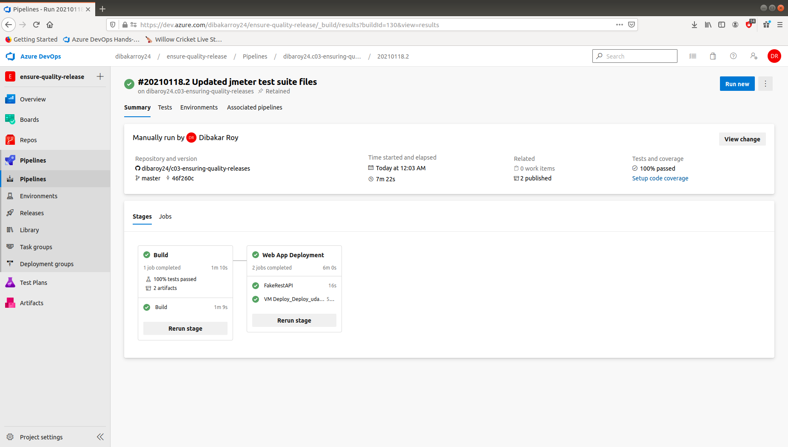

3. For Postman:

    * Create a Regression Test Suite from the Starter APIs. Use the Publish Test Results task to publish the test results to Azure Pipelines.
    * Create a Data Validation Test Suite from the Starter APIs.

    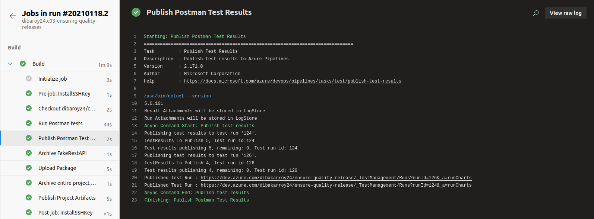

    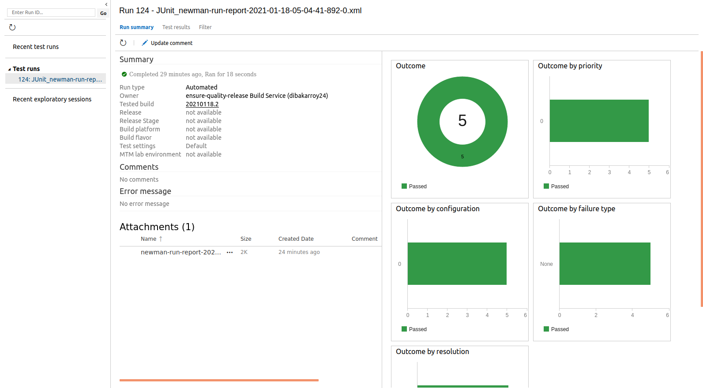

    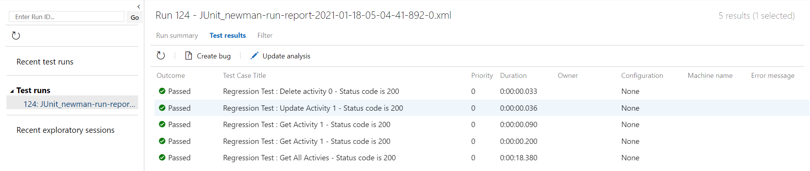

4. For Selenium:

    * Create a UI Test Suite that adds all products to a cart, and then removes them.
    * Include print() commands throughout the tests so the actions of the tests can easily be determined. E.g. A login function might return which user is attempting to log in and whether or not the outcome was successful.
    * Deploy the UI Test Suite to the linux VM and execute the Test Suite via the CI/CD pipeline.

    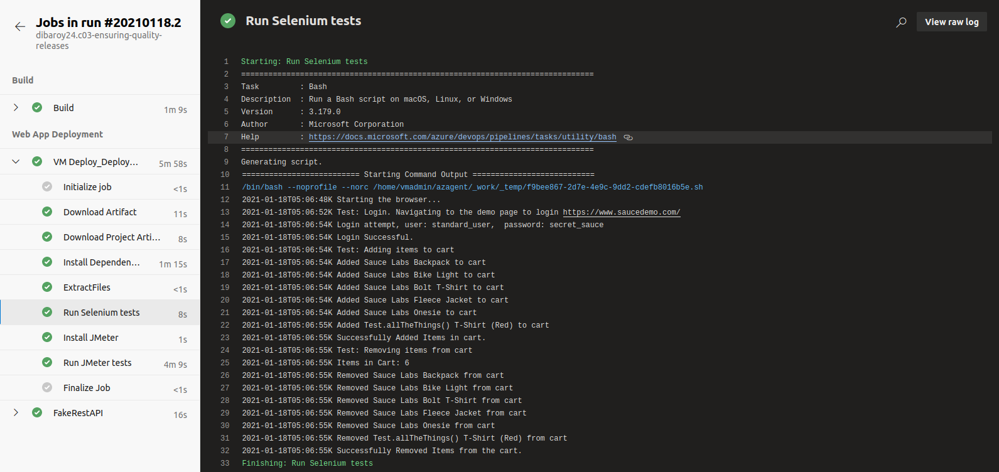

5. For JMeter:

    * Use the starter APIs to create two Test Suites. Using variables, reference a data set (csv file) in the test cases where the data will change.
    * Create a Stress Test Suite
    * Create a Endurance Test Suite
    * Generate the HTML report (non-CI/CD) IMPORTANT: Since the AppService is using the Basic/Free plan, start small (2 users max) and once you are ready for the final submission, use up to 30 users for a max duration of 60 seconds. The "Data Out" quota for the AppService on this plan is only 165 MiB.

    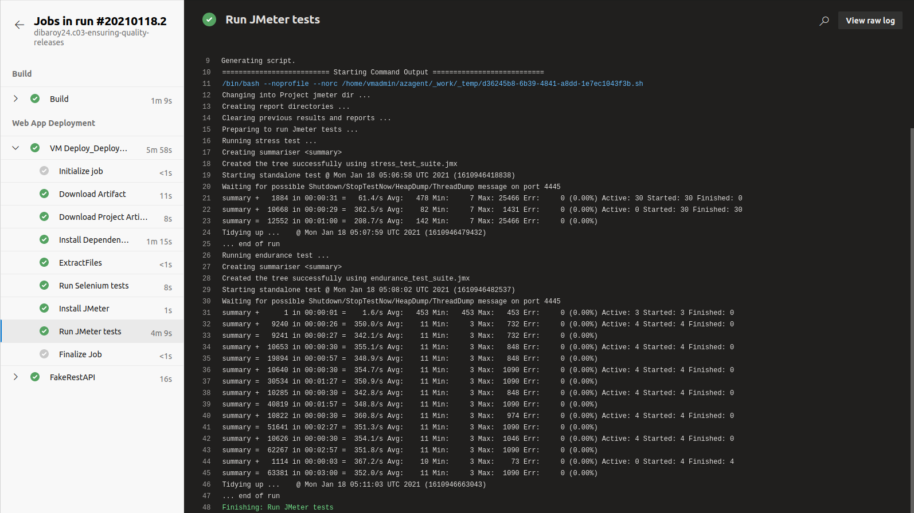

    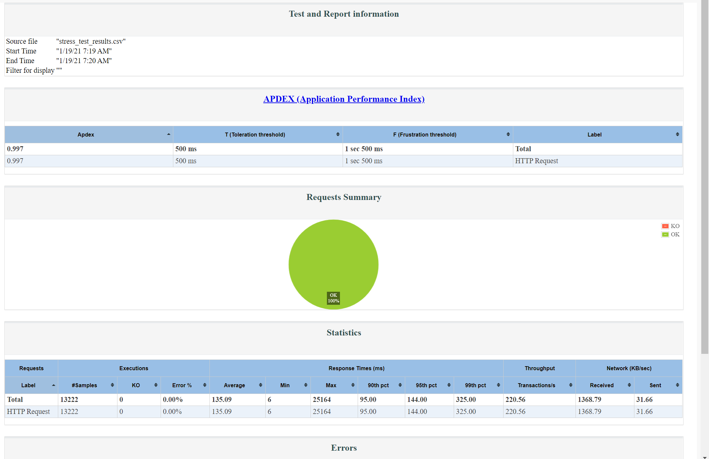

    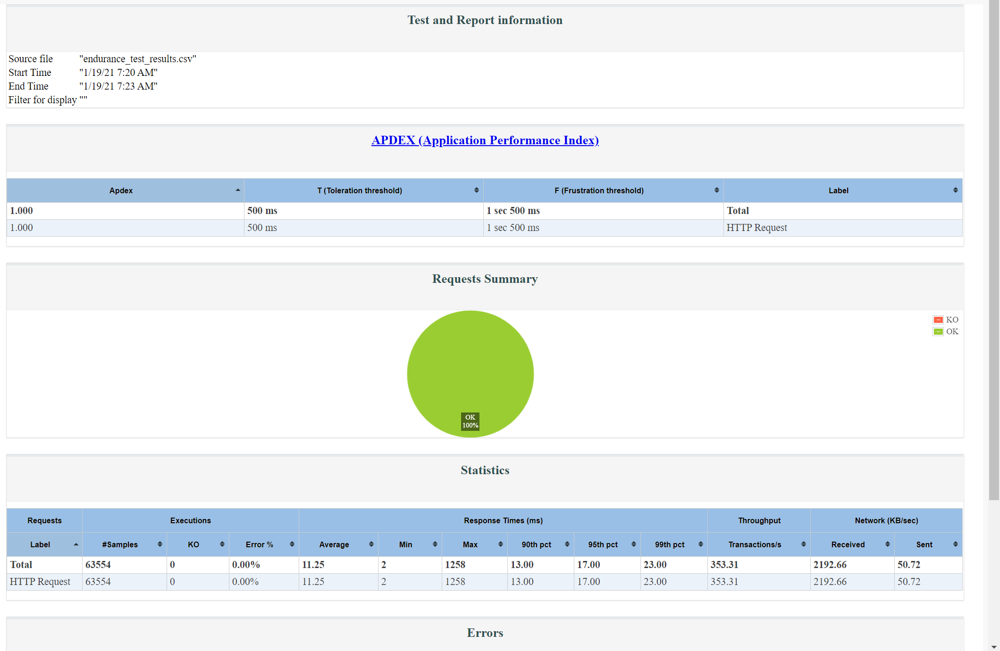

6. For Azure Monitor:

    * Configure an Action Group (email)
    * Configure an alert to trigger given a condition from the AppService
    * The time the alert triggers and the time the Performance test is executed ought to be very close.

    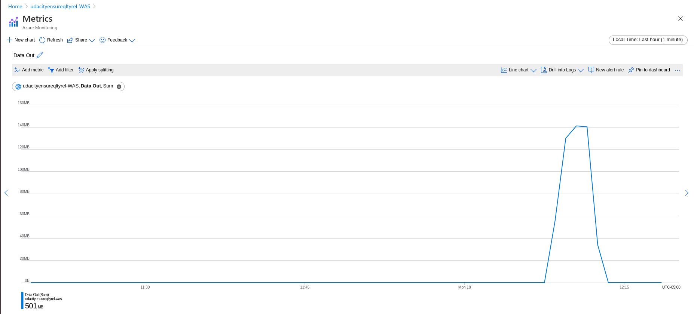

    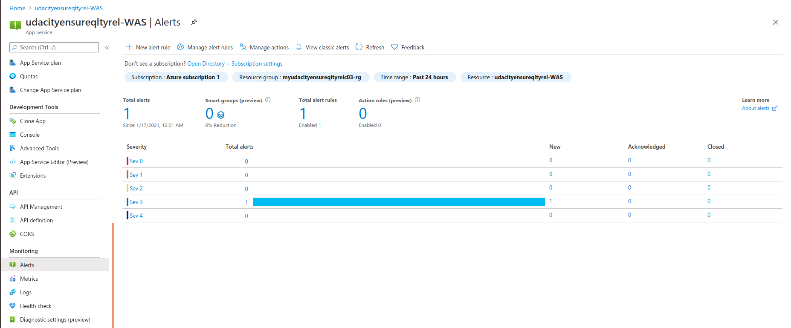

    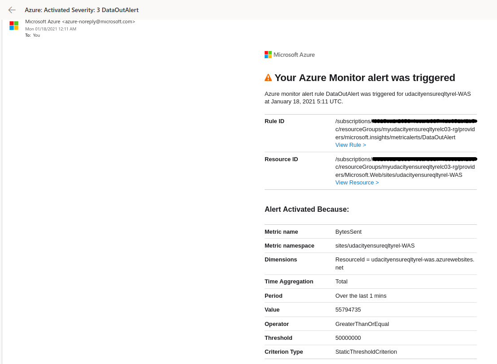

7. Direct the output of the Selenium Test Suite to a log file, and execute the Test Suite. Configure custom logging in Azure Monitor to ingest this log file. This may be done non-CI/CD.

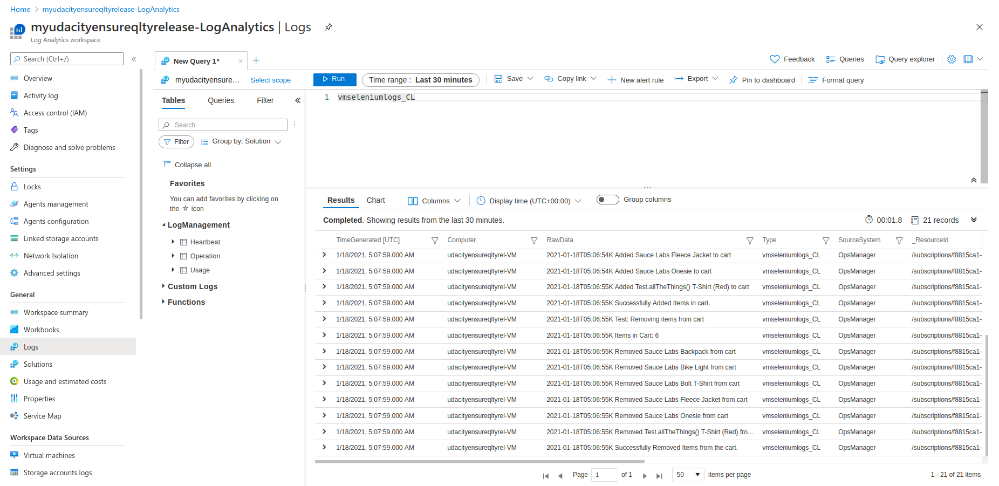

### The files included are

```sh
* /project-screenshots: Folder containing the screenshots of the results
* /infra-provision-pipeline: Folder containing the azure-pipelines.yml file that was used to build the infrastructure
* selenium_log.txt: The text file (residing under selenium folder) containing the Selenium logs which can be used to configure custom logging in Azure Monitor
* /jmeter/stress_test_html_report: Folder containing the HTML report for the JMeter Stress Test
* /jmeter/endurance_test_html_report: Folder containing the HTML report for the JMeter Endurance Test
```

### Other Helpful Resources

Please see below some of the references that might be helpful in carrying out this project.

* [Deploying Terraform Infrastructure using Azure DevOps Pipelines Step by Step](https://gmusumeci.medium.com/deploying-terraform-infrastructure-using-azure-devops-pipelines-step-by-step-advanced-1281b4ee15d1)
* [Azure DevOps: VM Deployment Environments](https://www.freshbrewed.science/azure-devops-vm-deployment-environments/index.html)
* [How to Configure postman / newman API tests in Azure DevOps or TFS and Publish HTML Results?](https://medium.com/@ganeshsirsi/how-to-configure-postman-newman-api-tests-in-azure-devops-or-tfs-and-publish-html-results-caf60a25c8b9)
* [Collect custom logs with Log Analytics agent in Azure Monitor](https://docs.microsoft.com/en-us/azure/azure-monitor/platform/data-sources-custom-logs)

